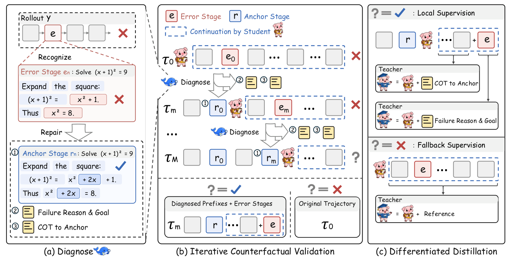
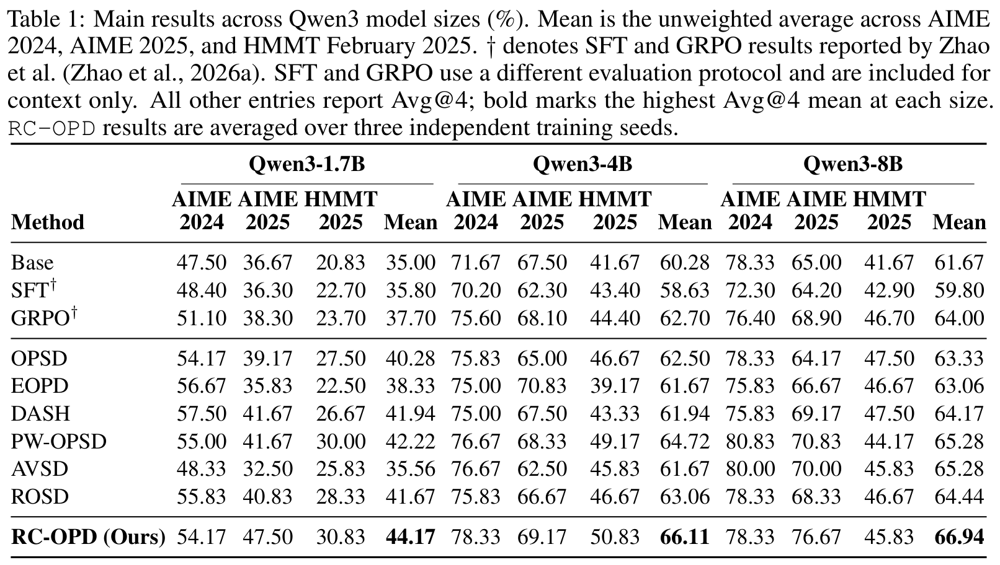

<h1 align="center">RC-OPD</h1>

<p align="center">Learning from Repaired Reasoning: Root-Cause-Guided On-Policy Distillation</p>

<div align="center">

[](https://arxiv.org/abs/2610.03515)
[](https://huggingface.co/starrylay/RC-OPD)
[](evaluate.py)
[](LICENSE)

</div>

## 📣 Release Status

Checkpoints and evaluation code are available. This work is **under review**; training code will be released after review.

## 💡 Overview

**RC-OPD** learns from local repairs of the student's own reasoning through three components:

1. **Diagnose:** locate the earliest substantive error, repair it into an anchor stage, and explain the correction.
2. **Iterative Counterfactual Validation:** let the student continue from the repair and check whether it reaches a correct answer.
3. **Differentiated Distillation:** use diagnosis-guided supervision for erroneous segments and anchor-guided supervision for valid prefixes, with reference-based fallback when repair fails.



*Figure 4 from the [paper](https://arxiv.org/pdf/2610.03515#page=5).*

## 📊 Main Results

Comparison with baselines across Qwen3-1.7B, 4B, and 8B on AIME24, AIME25, and HMMT25. The paper reports RC-OPD results averaged over three independent training seeds. SFT and GRPO use a different evaluation protocol and are included for context only.



*Table 1 from the [paper](https://arxiv.org/pdf/2610.03515#page=8). Click the image to view it at full resolution.*

## 📦 Released Checkpoints

We release **1.7B, 4B, and 8B LoRA adapters** for the matching Qwen3 base models. Click a model below to download its checkpoint.

Full OPSD-aligned evaluation: 30 problems per benchmark, four solutions per problem. **Avg@4 (%)** averages correctness across all generated solutions; Mean averages the three benchmarks.

| Model | AIME24 | AIME25 | HMMT25 | Mean |
|---|---:|---:|---:|---:|
| [RC-OPD-1.7B](https://huggingface.co/starrylay/RC-OPD/tree/main/RC-OPD-1.7B) | 54.17 | 47.50 | 30.83 | 44.17 |
| [RC-OPD-4B](https://huggingface.co/starrylay/RC-OPD/tree/main/RC-OPD-4B) | 78.33 | 69.17 | 50.83 | 66.11 |
| [RC-OPD-8B](https://huggingface.co/starrylay/RC-OPD/tree/main/RC-OPD-8B) | 78.33 | 76.67 | 45.83 | 66.94 |


## 🛠️ Setup

Use **Linux, Python 3.10, and CUDA compatible with PyTorch 2.8**.

```bash
git clone https://github.com/Starrylay/RC-OPD.git
cd RC-OPD
python -m venv .venv
source .venv/bin/activate
pip install -r requirements.txt
```

## 🚀 Quick Start

One command downloads the base model, adapter, and benchmarks, then evaluates all three benchmarks:

```bash
python evaluate.py --size 1.7B --output results/1.7B
```

Replace `1.7B` with `4B` or `8B` for the other models. Each run saves generated solutions, correctness labels, and protocol records; **`summary.json`** reports the three Avg@4 scores and their mean. Use a new output directory for each run.

<details>
<summary>More options: download only, multiple GPUs, and local checkpoints</summary>

```bash
# Download model files first, without running evaluation.
python evaluate.py --size 8B --download-only

# Use multiple GPUs when needed for model weights and the long context.
CUDA_VISIBLE_DEVICES=0,1 python evaluate.py --size 8B \
  --tensor-parallel-size 2 --output results/8B

# Evaluate a downloaded adapter and base model on one benchmark.
python evaluate.py --checkpoint /path/to/RC-OPD-4B \
  --model-path /path/to/Qwen3-4B --dataset aime24 --output results/local-4B
```


Downloads are cached by Hugging Face; set `HF_HOME` to choose the cache location. No training setup or external diagnosis service is needed.

</details>

## 📝 Evaluation protocol

The original OPSD evaluator is included in [`evaluation/official_opsd.py`](evaluation/official_opsd.py). The entry point fixes the reported protocol and checks that the requested adapter is applied.

```text
{problem}

Please reason step by step, and put your final answer within \boxed{}.
```

- **Prompt:** one user message, Qwen3 chat template, thinking enabled.
- **Sampling:** 4 solutions per problem; temperature 1.0, top-p 0.95, top-k −1, min-p 0, presence penalty 0.
- **Length:** up to 38,912 new tokens; 40,960-token model context.
- **Scoring:** final boxed answer checked with `math_verify`; normalized string fallback on verifier exceptions. Missing boxed answers are incorrect.
- **Metric:** Avg@4 = correct solutions / 120 × 100 per benchmark; Mean averages the three benchmark scores.

Benchmarks download automatically: [AIME24](https://huggingface.co/datasets/HuggingFaceH4/aime_2024), [AIME25](https://huggingface.co/datasets/yentinglin/aime_2025), and [HMMT25](https://huggingface.co/datasets/MathArena/hmmt_feb_2025), using their full `train` splits. Sampling and runtime differences can change scores between runs; the table records the released checkpoints' measured results.


## 📄 Citation

If you find this work useful, please cite our paper:

```bibtex
@misc{shen2026learningrepairedreasoningrootcauseguided,
  title         = {Learning from Repaired Reasoning: Root-Cause-Guided On-Policy Distillation},
  author        = {Chenglei Shen and Haoyang Yao and Weijie Yu and Song Jin and Xiao Zhang and Jun Xu},
  year          = {2026},
  eprint        = {2610.03515},
  archivePrefix = {arXiv},
  primaryClass  = {cs.CL},
  url           = {https://arxiv.org/abs/2610.03515}
}
```
